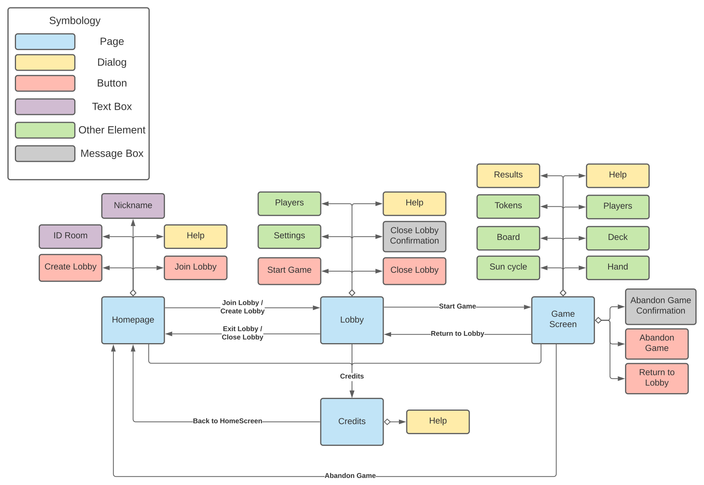
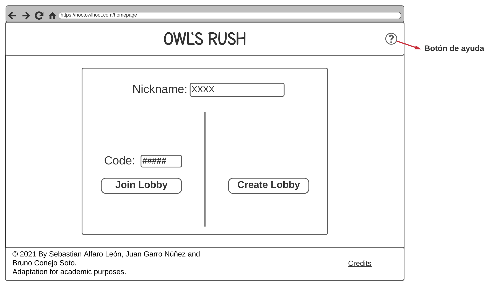
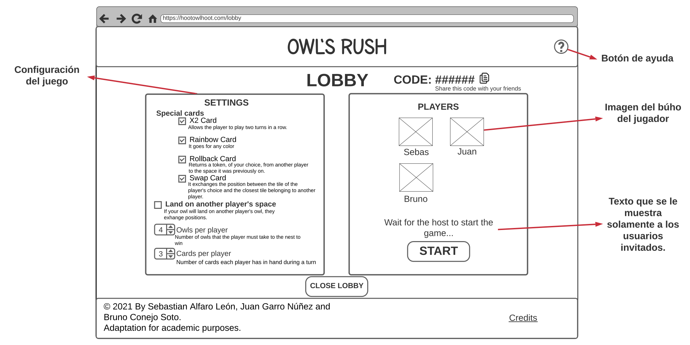
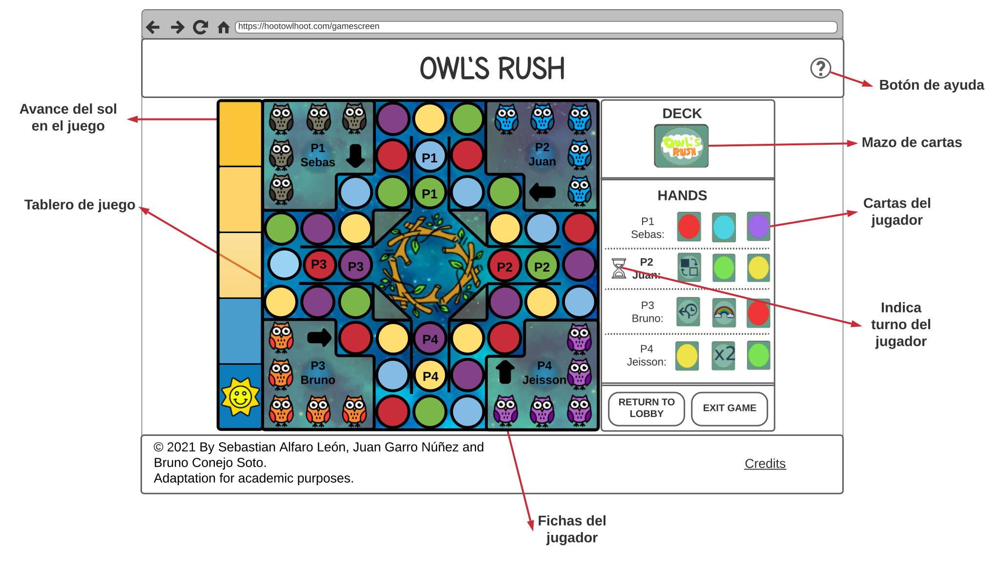
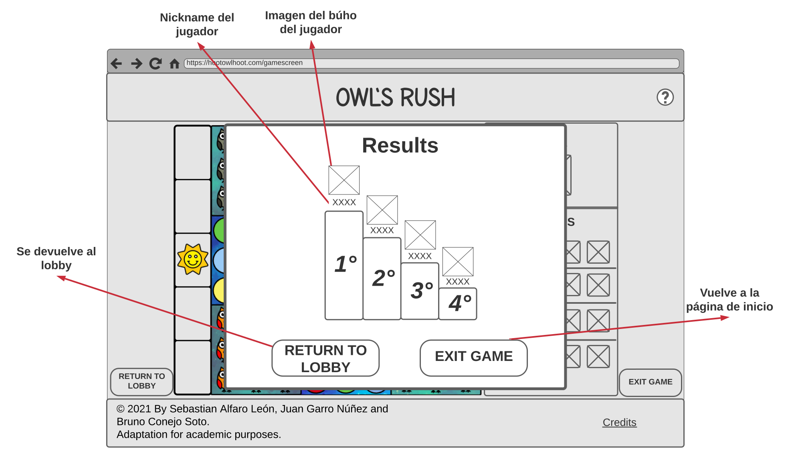
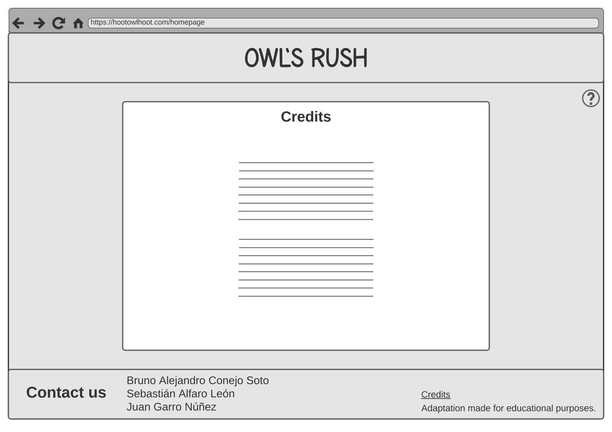
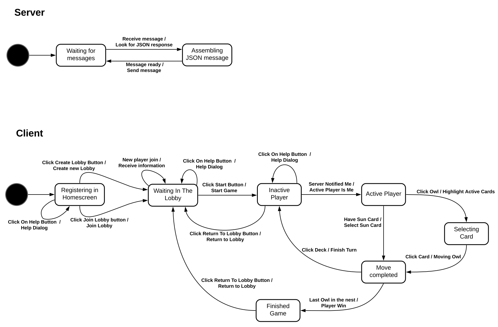
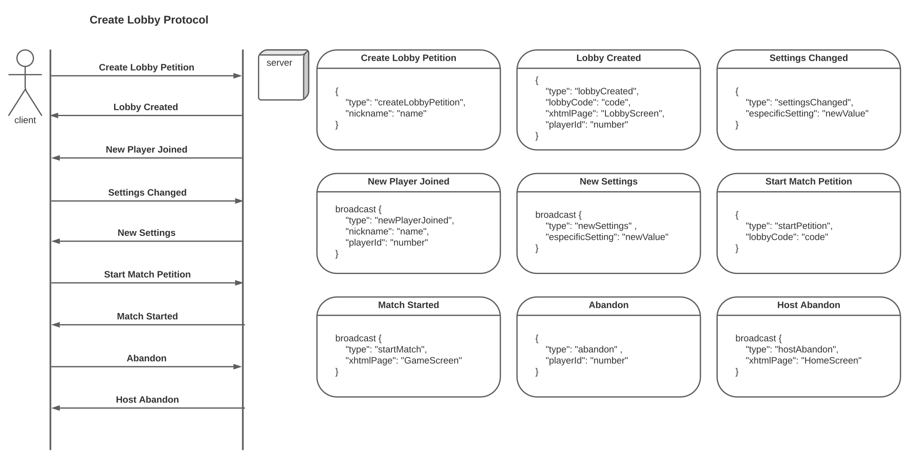
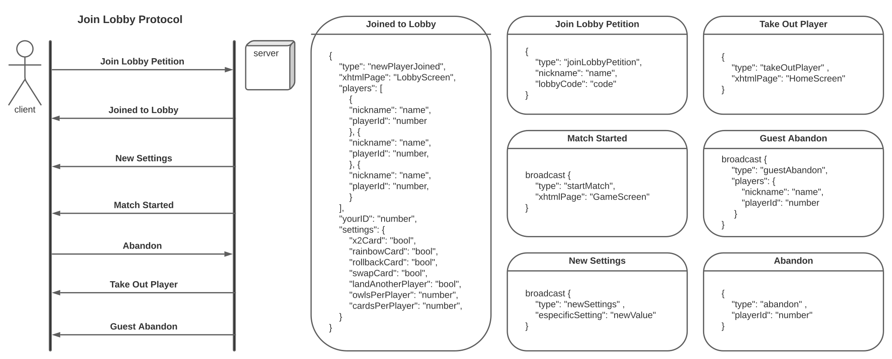
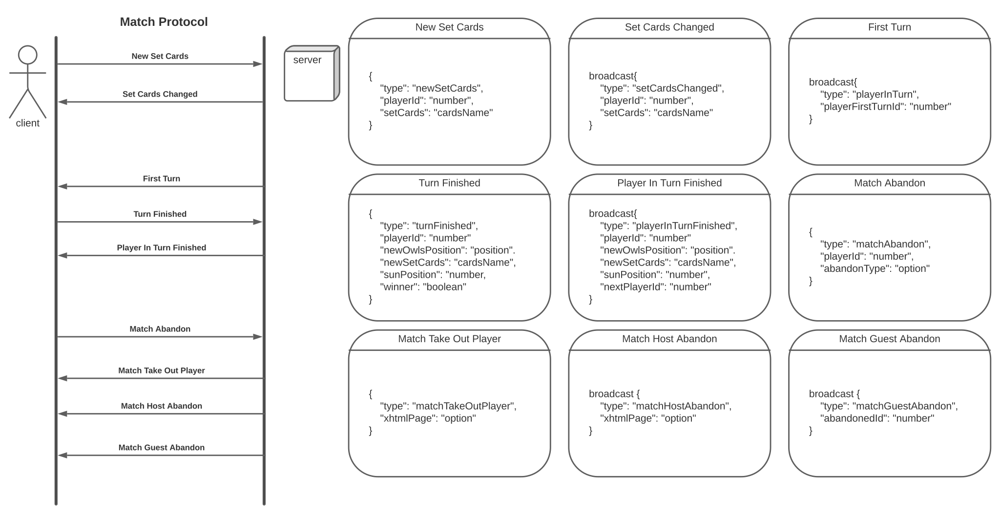

# Diseño de la Estructura del sitio
La siguiente imagen muestra el sitio del mapa:

# Diseño de Interfaz

En la carpeta wireframes se encuentran las imágenes del diseño de interfaz del sitio web Owl's Rush, que se exponen a continuación:

* Al presionar el botón de ayuda, en el encabezado, se despliega un diálogo que indica el contenido y comportamiento de la página.
* Al presionar el enlace *Credits*, en el pie de página, se redirige a la página de Créditos.

Los **wireframes** de cada página del sitio:

1. **Pantalla de inicio**:  El usuario puede ingresar el *Nickname* y unirse a una sala o crear una sala.
    
2. **Sala de espera**: Existen dos tipos de usuarios para las partidas: el anfitrión y el invitado. En esta sala el anfitrión puede configurar las opciones de la partida e iniciar la partida. El invitado podrá observar las configuraciones de la partida, sin embargo, no se le permite editarlas, ni iniciar la partida.
    
3. **Pantalla de juego**: Pantalla de juego, donde se encuentra el tablero y otros elementos para jugar. Al repartir cartas por primera vez no se pueden obtener cartas especiales. El comportamiento esperado para un turno de un jugador es el siguiente:
    1. Cuando un jugador tiene el turno al lado le aparece un ícono de un reloj y se le habilita la opción de seleccionar sus búhos y cartas especiales.
    2. El jugador selecciona el búho que desea mover, luego el sistema le destaca las posibles opciones para moverse según las cartas de color que tenga el jugador. Cuando elije la carta, el búho se mueve automáticamente y la carta usada se elimina; después el jugador debe tocar el mazo de cartas para obtener una nueva y termina su turno.
    3. Cartas especiales, se pueden guardar para utilizarlas cuando el jugador quiera, a excepción de la Carta de Sol. A continuación se presenta el listado de cartas especiales:
        1. Carta de Sol: si el jugador obtiene esta carta, está obligado a usarla en su siguiente turno. El efecto de esta carta es avanzar la posición del Sol un espacio, si el Sol llega al último espacio el jugador que completó el ciclo debe retroceder al punto de partida su búho más próximo al nido. El ciclo del sol se reinicia cada vez que se completa.
        2. Carta Rainbow: carta que, al seleccionarla, se puede cambiar por cualquier carta de color.
        3. Carta X2: permite al jugador jugar dos turnos seguidos. Al activar esta carta, es reemplazada por una carta de color aleatoria.
        4. Carta Rollback: devuelve una ficha, a elección, de otro jugador a la casilla en la que estuvo anteriormente, cuenta como el turno del jugador.
        5. Carta Swap: intercambia la posición entre la ficha a elección del jugador y la ficha más proxima perteneciente a otro jugador.
    
4. **Resultados**: Diálogo que se observa en la pantalla de juego cuando se completa la partida, en donde se muestran los resultados de la partida.
    
5. **Créditos**: Página donde se le da crédito a los autores de las imágenes o recursos que se utilicen.
    

# Diseño de la Comunicación
1. La siguiente imagen muestra la máquina de estados para la aplicación web:

A continuacion se detallan los algoritmos de las trancisiones para la máquina de estados del servidor:

    1. Receive message / Look for JSON response:
        Call assembling message

    2.  Message ready / Send message:
        switch message.type
            case "createLobbyPetition":
                Assembling message "Lobby Created"
                Send message to client
                break;
            
            case "Join Lobby Petition":
                Assembling message "Joined to Lobby"
                Send message to client

                Assembling message "New Player Joined"
                Send message by broadcast
                break;

            case "Settings Changed":
                Assembling message "New Settings
                Send message by broadcast
                break;

            case "Start Match Petition":
                Assembling message "Match Started"
                Send message by broadcast
                Assembling message "First Turn"
                Send message by broadcast
                break;

            case "Abandon":
                if client is host then:
                    Assembling message "Host Abandon"
                    Send message by broadcast
                else:
                    Assembling message "Guest Abandon"
                    Send message by broadcast
                    Assembling message "Take Out Player"
                    Send message to client
                break;

            case "Turn Finished":
                Assembling message "Player In Turn Finished"
                Send message by broadcast
                break;
            
            case "Match Abandon":
                if client is host then:
                    Assembling message "Match Host Abandon"
                    Send message by broadcast
                else:
                    Assembling message "Match Guest Abandon"
                    Send message by broadcast
                    Assembling message "Match Take Out Player"
                    Send message to client
                break;
            
            case defualt:
                break;

A continuacion se detallan los algoritmos de las trancisiones para la máquina de estados del cliente: 

    1. Click Create Lobby Button / Create new Lobby:
        Send message "Create Lobby Petition" to server
        Receive message "Lobby Created" from server
        Set Lobby Code using "lobbyCode": "code" comming from that message
        Change to xhtmlPage "LobbyScreen"

    2. Click Join Lobby Button / Join Lobby:
        Send message "Join Lobby Petition" to server
        Receive message "Joined to Lobby" from server
        Set my ID using "yourID": "number" comming from that message
        Change to xhtml page "LobbyScreen"

    3. Click On Help Button / Help Dialog:
        Display Help Dialog
        if Click On Help Button:
            Close Help dialog

    4. New player join / Receive information:
        Receive message "New Player Joined" from server
        Update my Lobby Screen

    5. Click Start Button / Start Game:
        Send message "Start Match Petition" to server
        Receive message "Match Started" from server
        Change to the xhtml page "GameScreen"
        Save game configurations

    6. Click Return To Lobby Button / Return to Lobby:
        Display confirm dialog
        if confirm == true then:
            Notify all players
            Change to "LobbyScreen"

    7. Server Notified Me / Active Player Is Me:
        Receive message "First Turn" from server
        if playerFirstTurnId is me then:
            Enable my owls
        Receive message "Player In Turn Finished" from server
        if nextPlayerId is me then:
            if have Sun Card then:
                Enable Sun Card
            else:
                Enable my owls
    
    8. Click Owl / Highlight Active Cards:
        Disable my owls
        Enable my cards

    9. Click Card / Moving Owl:
        Disable my cards
        Delete used card
        if clicked card is color then:
            Search cell to move Owl
            move owl to cell
            If player owls in nest then:
                set player win
        else if clicked card is special then:
            active special card
        Enable Deck

    10. Have Sun Card / Select Sun Card:
        Advance sun one "space"
        if sun in last position then:
            Move sun to first position
            Move the player's owl at the head to initial position   
        Enable Deck

    11. Click Deck / Finish Turn:
        Generate new card
        Disable Deck
        Send message "Turn Finished" to server

    12. Last Owl in the nest / Player Win:
        if player win then:
            Display modal results
            Send message "Turn Finished" to server

2. A continuación se muestra el diseño del protocolo de paso de mensajes en JSON.
    1. Paso de mensajes entre el host y el servidor, cuando se crea una sala de juego.
        
    2. Paso de mensajes entre el guest y el servidor, cuando se une a una sala de juego.
        
    3. Paso de mensajes entre el server y los usuarios en la sesión de juego.
        
